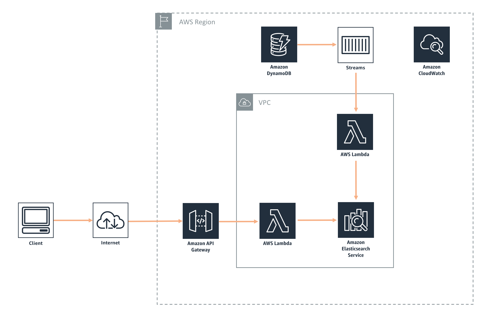

## Search API Extension

The Search API Extension enables you to add search functionality on top of your DynamoDB data powered by ElasticSearch and API Gateway. The extension can be created with a single CloudFormation template!

This extension takes in a DynamoDB table as a parameter. It will spin up an ElasticSearch cluster, stream changes from DynamoDB to ElasticSearch, and create a Search API.  You can choose an existing API Gateway id to integrate with or have the extension create a new one. 

Get started with adding search to your DynamoDB data below!

## License Summary

## Outline

- [Overview](#overview)
- [Instructions](#instructions)
  - [Getting started](#getting-started)
- [Architecture](#architecture)
- [Implementation details](#implementation-details)
  - [Amazon DynamoDB](#amazon-dynamodb-streams)
  - [Amazon API Gateway](#amazon-api-gateway)
  - [AWS Lambda](#aws-lambda)
- [Using the extension](#using-the-extension)
- [Suggestions](#suggestions)
- [Additions, forks, and contributions](#additions-forks-and-contributions)

## Overview

* Enable streams on your DynamoDB table to push updates
* Create an Elasticsearch cluster with best practices
* Process records and update Elasticsearch cluster via a Lambda function
* Create a Search API with Lambda
* Create or integrate with an existing API Gateway

## Instructions

*IMPORTANT NOTE*: Creating this application in your AWS account will create and consume AWS resources, which will cost *money*. We estimate that running this extension will cost in development mode (t2.small) will cost *<$0.10/hour* with light usage. In production mode (m4.large), the base cost will be around *$0.20/hr* with an additional $0.20/hr for each additional instance. 

## Getting started

To get the Search API Extension up and running in your AWS account, follow these steps (if you do not have an AWS account, please see How do I create and activate a new Amazon Web Services account? (https://aws.amazon.com/premiumsupport/knowledge-center/create-and-activate-aws-account/)):

1. Log into the AWS console (https://console.aws.amazon.com/) (if you are not already logged in)
2. Choose Launch Stack to open the AWS CloudFormation console and create a new stack.
3. Continue through the CloudFormation wizard steps
    1. Name your stack, e.g. SearchAPI
    2. Enter the name of the DynamoDB table to integrate with
    3. Specify an existing API Gateway ID to integrate with, or we will auto-create an API Gateway Resource for you
    4. After reviewing, check the blue box for creating IAM resources. 

4. Choose Create stack. This will take ~15 minutes to complete. 

## Architecture

## Implementation details

### Amazon DynamoDB Streams

Amazon DynamoDB Streams push updates to the *UpdateSearchCluster* Lambda function that updates the Amazon Elasticsearch cluster. 

### Amazon API Gateway

Amazon API Gateway acts as the interface layer between your frontend and AWS Lambda, which calls the backend (database). Below is the different APIs the extension creates:

*Search*

GET /search/{:q} (Search)

### AWS Lambda

AWS Lambda is used in a few different places to run the application, as shown in the architecture diagram. The important Lambda functions that are deployed as part of the template are shown below, and available in the functions (https://github.com/awslabs/aws-full-stack-template/blob/master/functions) folder. In the cases where the response fields are blank, the application will return a statusCode 200 or 500 for success or failure, respectively.

*Search* - Lambda function that returns a list of books based on provided search parameters in the request. 

*UpdateSearchCluster* - Lambda function that updates the ElasticSearch cluster when new items are added to the DynamoDB table.

### Amazon VPC

The Elasticsearch cluster is secured in an Amazon VPC (Virtual Private Cloud) for production-level security. The Lambda functions interact with the cluster through an ENI (Elastic Network Interface) that is automatically setup for you. 

## Using the extension

1. Head to the API Gateway console and click on your API Gateway resource
2. Select the search GET method
3. Click test and enter the search query q={query term}

## Suggestions

Have other ideas for extensions we should build? Leave a comment on GitHub!

## Additions, forks, and contributions

We are excited that you are interested in using the AWS Full-Stack Template! This is a great place to start if you are just beginning with AWS and want to get a functional application up and running. It is equally useful if you are looking for a sample full-stack application to fork off of and build your own custom application. We encourage developer participation via contributions and suggested additions. Of course you are welcome to create your own version!
Please see the contributing guidelines (https://github.com/awslabs/aws-full-stack-template/blob/master/CONTRIBUTING.md) for more information.

For just one example of how you can build on top of this, check out AWS Bookstore Demo App (available at https://github.com/aws-samples/aws-bookstore-demo-app), which was built on top of AWS Full Stack Template.

